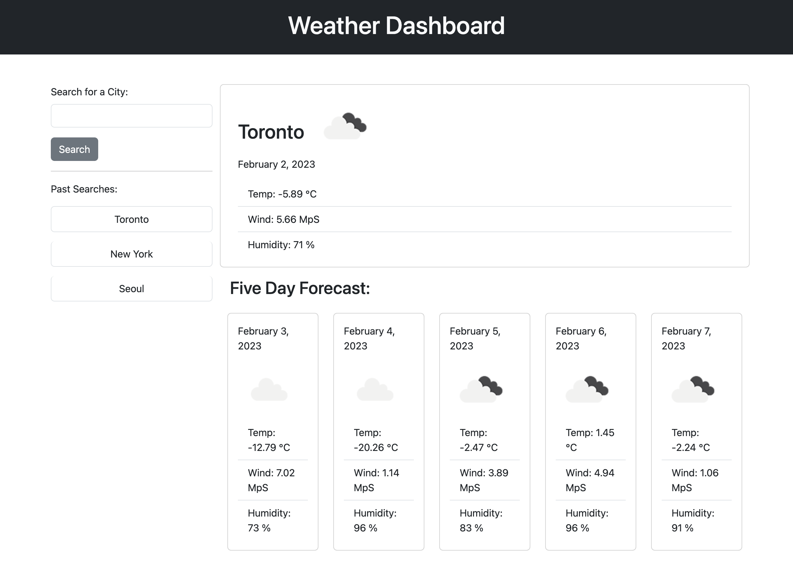

# Weather Dashboard 

## Description
This is a [weather dashboard](https://hannazo.github.io/weather-or-not/) that will run in the browser and feature dynamically updated HTML and CSS.

Functionality:
- Check weather outlook for multiple cities 
- See current weather and five day forecast 
- Automatically save your search history 

## Installation

No installation required. Simply click on the [link](https://hannazo.github.io/weather-or-not/) to open the Weather Dashboard in the browser of your choice. 

## Usage

Open https://hannazo.github.io/weather-or-not/ to access the web page. Search for a city you’d like to see the weather for on the left side search field. When you click on the “Search” button, you’ll be presented with current weather and a five day forecast. Your search will be automatically saved on the left side for easy retrieval. Search for another city to see current weather and a five day forecast. Click on the button with the name of the city you searched previously to see weather details again. 

## License

N/A
